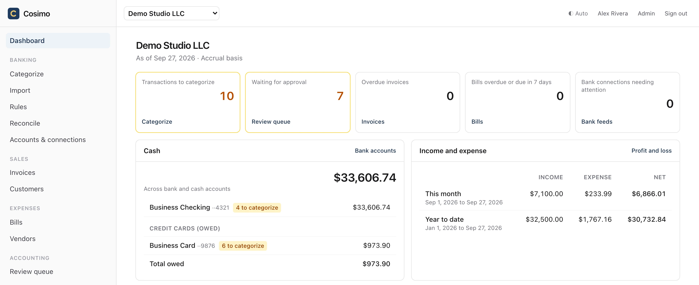
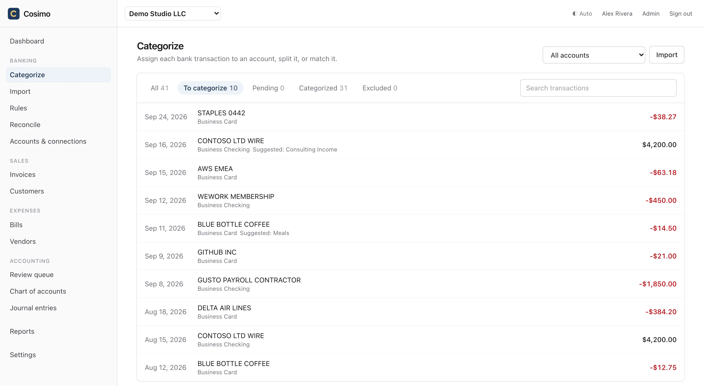
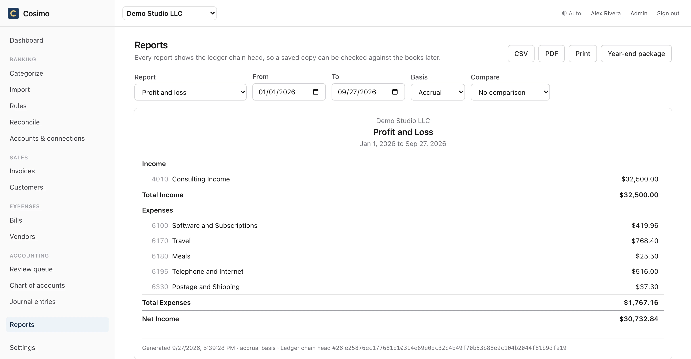
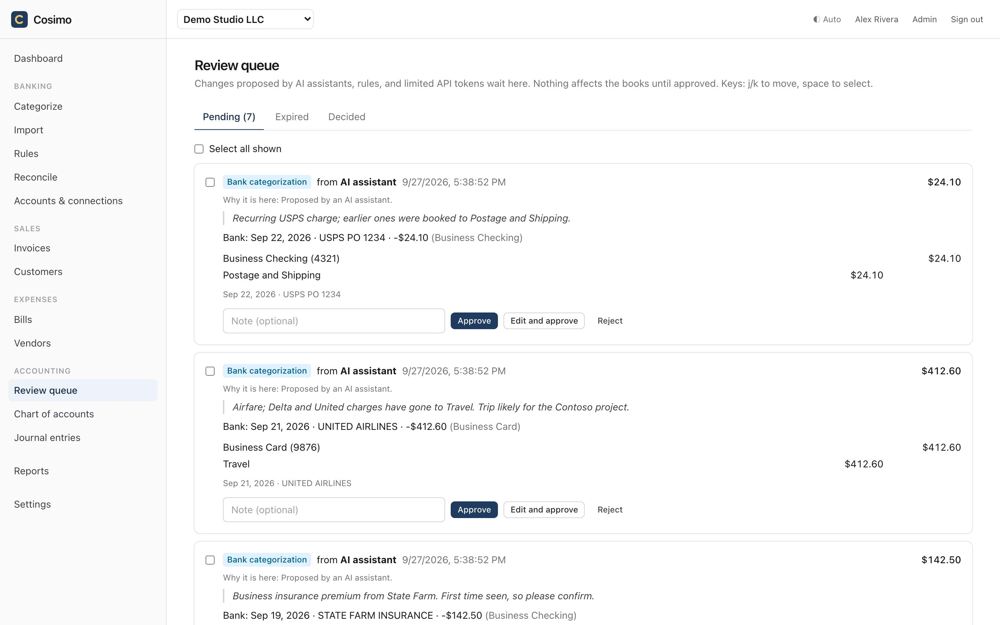

# Cosimo

**Your books, on your server. Open-source bookkeeping that replaces QuickBooks Online and Xero.**

[](https://github.com/steve-lomnes/cosimo/releases/latest)
[](https://github.com/steve-lomnes/cosimo/actions/workflows/ci.yml)
[](LICENSE)

[Quickstart](#quickstart) · [Deploy](docs/deployment.md) · [Import from QuickBooks, Xero or Wave](docs/importing.md) · [Use with AI](docs/mcp.md)

<picture>
  <source media="(prefers-color-scheme: dark)" srcset="docs/images/dashboard-dark.webp">
  
</picture>

You shouldn't have to pay $25, $50, or $100 a month, per company, to keep your own books in software
that feels ten years old. Cosimo is real double-entry accounting for freelancers, consultants, and
small businesses. It runs on your laptop, a $5 VPS, or the cloud account you already have, and it's
free. The data is a SQLite file you can copy, back up, and export whenever you like.

## Why Cosimo

- **You own it.** Your books live on your machine or your server, not in a vendor's cloud. Export
  everything in a [documented open format](docs/export-format.md) and import it into any other
  Cosimo instance. No lock-in, no account to cancel.
- **It's free.** MIT-licensed. There are no seats, no tiers, and no per-company pricing. Run as many
  businesses and invite as many users as you like.
- **It runs where you already run things.** A single binary, or a Docker image. `cosimo init` sets
  up a local instance, a Docker server with automatic HTTPS, or a Fly.io app. There are recipes for
  Railway, Render, Coolify, and plain systemd. SQLite by default, Turso and any S3-compatible
  bucket if you want them.
- **It's pleasant to use.** A fast, modern web app with a keyboard-first Categorize screen, light
  and dark themes, and a layout that works on your phone.
- **It's ready for AI.** A built-in MCP server lets Claude or any MCP client do the bookkeeping,
  and every change an AI proposes waits in a review queue until you approve it.

## Cosimo vs. QuickBooks Online and Xero

|                              | **Cosimo**                                   | QuickBooks Online           | Xero                        |
|------------------------------|----------------------------------------------|-----------------------------|-----------------------------|
| Price                        | Free (MIT)                                   | Monthly subscription        | Monthly subscription        |
| More than one business       | Unlimited, same instance                     | A subscription per company  | A subscription per org      |
| Where your books live        | Your computer, server, or cloud              | Intuit's cloud              | Xero's cloud                |
| Source code                  | Open                                         | Closed                      | Closed                      |
| Leaving                      | Full books in an open format, re-importable  | Report and list exports     | Report and list exports     |
| AI assistants                | Built-in MCP server, human approval on writes | Vendor's own AI features    | Vendor's own AI features    |
| History                      | Tamper-evident hash chain                    | Audit log                   | Audit log                   |

Also coming from **FreshBooks** or **Wave**? The same applies: Cosimo keeps the books you'd otherwise
rent. See [what Cosimo doesn't do yet](#what-cosimo-doesnt-do-yet) before you switch.

## Features

<table>
  <tr>
    <td width="50%">

<picture>
  <source media="(prefers-color-scheme: dark)" srcset="docs/images/categorize-dark.webp">
  
</picture>

</td>
    <td width="50%">

<picture>
  <source media="(prefers-color-scheme: dark)" srcset="docs/images/pnl-dark.webp">
  
</picture>

</td>
  </tr>
</table>

**Daily bookkeeping**
- Bank feeds through [Plaid](docs/plaid.md) with your own keys, or import CSV, OFX, and QFX files
  (column mappings are remembered per account).
- Categorize, split, match, or mark transfers from one keyboard-driven screen. Rules categorize
  repeat transactions automatically, and suggestions learn from what you did last time.
- Bank and credit card reconciliation.
- Receipts and attachments on any transaction, stored locally or in S3-compatible storage.

**Getting paid and paying bills**
- Invoices with your logo, emailed as PDFs over your own SMTP, with partial payments, credits, and
  optional overdue reminders.
- Bills and vendors, with 1099 tracking.

**Reports and year-end**
- Profit and Loss, Balance Sheet, Trial Balance, General Ledger, Cash Flow, AR and AP aging,
  1099 summary, and tax line summary (for example, Schedule C). Cash or accrual basis, with
  comparison periods, CSV and PDF export, and drill-down to every entry.
- One click builds a year-end package for your CPA: every report they need, in one ZIP.
- Invite your accountant with a read-only role. Owner, bookkeeper, accountant, and viewer roles are
  set per business.

**Trust and safety**
- Double-entry invariants enforced in the database, plus lock dates.
- A hash-chained ledger and audit log, so any change to posted history is
  [detectable](docs/chain-format.md).
- Nightly backups, with one-command restore.
- Bank tokens and other secrets encrypted at rest with AES-256-GCM. TOTP two-factor login.

**Built for developers**
- Everything in the UI is in the REST API. Docs are at `/api/docs`, and OpenAPI 3.1 at
  `/api/v1/openapi.json`.
- MCP server with OAuth, and a [bookkeeping skill](skills/cosimo-bookkeeping/SKILL.md) for the
  monthly close, invoice follow-up, and year-end package.
- A scriptable setup: `cosimo init --json` and a stable agent contract in [AGENTS.md](AGENTS.md).

## Quickstart

macOS and Linux:

```sh
curl -fsSL https://github.com/steve-lomnes/cosimo/releases/latest/download/install.sh | sh
```

Windows (PowerShell):

```powershell
irm https://github.com/steve-lomnes/cosimo/releases/latest/download/install.ps1 | iex
```

The installer checks the release's SHA-256 (and its cosign signature, when `cosign` is installed),
then runs `cosimo init`. Pick local, Docker, or Fly.io, answer a few questions, and open the claim
link it prints to set your password. It can seed a sample business so you can look around first.

Prefer containers? The image is `ghcr.io/steve-lomnes/cosimo:<version>`. See
[docs/deployment.md](docs/deployment.md).

## Use it with Claude, or any MCP client

Add `https://<your instance>/mcp` as a connector. Your assistant can then read the books and propose
work, and each write carries a short rationale and waits in the review queue for you:

> "Categorize last week's bank transactions, then tell me which invoices are overdue."

<picture>
  <source media="(prefers-color-scheme: dark)" srcset="docs/images/review-dark.webp">
  
</picture>

You decide what gets auto-approved. For example, you might let small categorizations to familiar
accounts through and hold everything else. See [docs/mcp.md](docs/mcp.md).

## Moving from QuickBooks Online, Xero, or Wave

Cosimo imports your chart of accounts, contacts, and full transaction history. The history arrives
as one batch in the review queue, so you can check it before it posts.
See [docs/importing.md](docs/importing.md).

## What Cosimo doesn't do (yet)

Payroll, inventory, sales tax calculation, and multi-currency are out of scope for now. Bank feeds
through Plaid need your own Plaid account, and Plaid's pricing applies; file import is free and
works everywhere. Online invoice payments go through your own Stripe account; Stripe refunds,
disputes, and payout matching aren't handled automatically yet.

## Documentation

| Topic | |
|---|---|
| Deploying (Docker, Fly.io, Railway, Render, Coolify, systemd) | [docs/deployment.md](docs/deployment.md) |
| Bank feeds | [docs/plaid.md](docs/plaid.md) |
| Online invoice payments (Stripe) | [docs/stripe.md](docs/stripe.md) |
| Importing from other products | [docs/importing.md](docs/importing.md) |
| Attachments and backups in S3-compatible storage | [docs/object-storage.md](docs/object-storage.md) |
| Export format | [docs/export-format.md](docs/export-format.md) |
| AI assistants (MCP) | [docs/mcp.md](docs/mcp.md) |
| Setting up Cosimo with an AI agent | [AGENTS.md](AGENTS.md) |

Day-to-day operations: `cosimo backup` (it also runs nightly), `cosimo restore <file>`,
`cosimo export <org_id>`, `cosimo upgrade` (backs up, then migrates), and `cosimo doctor`.

## Development

Bun, Hono, Drizzle, libSQL, React, Vite, and Tailwind.

```sh
bun install
bun run check        # lint + typecheck + tests
bun run dev          # server on http://localhost:8787
```

## License

MIT © 2026 Stephen Lomnes

*Named after Cosimo de' Medici, who built the Medici bank on disciplined double-entry books.*
